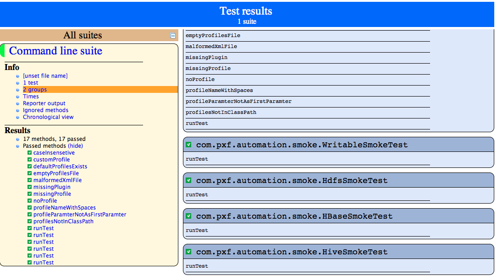

Pxf Automation
===================================
Contains all the PXF automation tests for the various functionalities of PXF  
The automation framework uses TestNg APIs and tools to complete automatic testing for PXF. Compiling and running TestNg test cases being used via maven.
The Automation framework also exposes simple APIs for performing actions on services including GPDB, PXF, HDFS, HBase and Hive or to use utilities such data comparison, reading and writing files , using tools such TINC for query analysis and more.
 
Dependencies
===================================
In order to run PXF automation tests the following are needed

1. Running Hadoop cluster 
2. Running GPDB
3. JRE 1.8

Build & Test
===================================

Set necessary Environment Vars
```
export GPHD_ROOT=<parent directory containing hadoop,hive,etc>
export PGPORT=<gpdb port>
export GPHOME=<your gphome>
export PXF_HOME=/usr/local/pxf
```

Run all tests for GPDB
```
make GROUP=gpdb
```

Run specific test 
```
make TEST=<testclassname>
```

Run specific method from a test
```
make TEST=<testclassname>#<method>
```

If you wish to remote debug your PXF Automation test case 
```
export MAVEN_DEBUG_OPTS=' -Dmaven.surefire.debug'
```

If you wish to run with cache 
```
make OFFLINE=true
```

Note: if you get an error saying that the jar does not exist, ensure that you have
a) installed the PXF server, and
b) only have 1 jar file inside `/usr/local/pxf/application/`

### Project structure
_**src/main/java**_ - contains related classes and utilities for the test

**_src/test/java_** - contains the TestNG cases.

**_tincrepo_** - contains tinc test cases.

**_src/main/java/org/greenplum/pxf/automation/components_** - contains all the supported services/components with simple API abstractions. 

### General Automation Architecture
TestNG is a powerful Java testing framework very similar to junit which supports several features like grouping, parallel run and test events listeners.
You can read more about TestNG here http://testng.org/doc/index.md

## Guidelines for creating a new test for PXF automation

1.  Decide which category of run cycle (smoke/feature/load)
2.  Extend the right java class (according to the above test class hierarchy diagram)
3.  While implementing "smoke" test you can override three methods: "<span><span>prepareData", "</span></span><span><span>createTables" and "</span></span><span><span>queryResults" and than just call "</span></span><span>runTest" method from your test case for running the three mentioned methods in that order. (see *Example 1*)</span>
4.  Use TINC framework to test GPDB query results (see below "*Add TINC Cases*" section)

## Add TINC Cases


**_tincrepo/main/pxf_**  - root for PXF TINC cases, the cases inside ordered in TestNg folders hierarchy

**_sql_** - sql files

**_expected_** - expected results matched to the sql files

**_output_** - output of run including diff files for each sql file

## Test Examples
1.  **Example 1 (Smoke case)**

    ``` theme:
    public class HdfsSmokeTest extends BaseSmoke {

        String fileName = "hdfsSmallData.txt";

        @Override
        protected void beforeClass() throws Exception {
        }

        @Override
        protected void prepareData() throws Exception {
            /**
             * Create Data and write it to HDFS
             */
            Table dataTable = getSmallData();

            hdfs.writeTextFile(hdfs.getWorkingDirectory() + "/" + fileName, dataTable.getData(), ",");
        }

        @Override
        protected void createTables() throws Exception {
            /**
             * Create GPDB external table directed to the HDFS file
             */
            exTable = TableFactory.getPxfReadableTextTable("pxf_smoke_small", new String[] {
                    "name text",
                    "num integer",
                    "dub double precision",
                    "longNum bigint",
                    "bool boolean" }, hdfs.getWorkingDirectory() + "/" + fileName, ",");

            gpdb.createTableAndVerify(exTable);
        }

        @Override
        protected void queryResults() throws Exception {
            /**
             * Run Tinc "small data" test
             */
            runTincTest("pxf.small_data.runTest");
        }
        @Test(groups = "smoke")
        public void test() throws Exception {
            runTest();
        }
    }
    ```

2.  **Example 2 (Feature case)**

    ``` theme:
    public class HdfsReadableTextTest extends BaseFeature {
        // holds data for file generation
        Table dataTable = null;
        // path for storing data on HDFS
        String hdfsFilePath = "";

        /**
         * Before every method determine default hdfs data Path, default data, and default external
         * table structure. Each case change it according to it needs.
         * 
         * @throws Exception
         */
        @Override
        protected void beforeMethod() throws Exception {
            super.beforeMethod();
            // path for storing data on HDFS
            hdfsFilePath = hdfs.getWorkingDirectory() + "/data";
            // prepare data in table
            dataTable = new Table("dataTable", null);
            FileFormatsUtils.prepareData(new CustomTextPreparer(), 100, dataTable);
            // default definition of external table
            exTable = new ReadableExternalTable("pxf_hdfs_small_data", new String[] {
                            "s1 text",
                            "s2 text",
                            "s3 text",
                            "d1 timestamp",
                            "n1 int",
                            "n2 int" }, hdfsFilePath, "TEXT");

            exTable.setHost(pxfHost);
        }

        /**
         * Read delimited text file from HDFS using explicit plugins and TEXT format.
         * 
         * @throws Exception
         */
        @Test(groups = { "features" })
        public void readDelimitedTextUsingTextFormat() throws Exception {
            // set plugins and delimiter
            exTable.setFragmenter("com.pivotal.pxf.plugins.hdfs.HdfsDataFragmenter");
            exTable.setAccessor("com.pivotal.pxf.plugins.hdfs.LineBreakAccessor");
            exTable.setResolver("com.pivotal.pxf.plugins.hdfs.StringPassResolver");
            exTable.setDelimiter(",");
            // create external table
            gpdb.createTableAndVerify(exTable);
            // write data to HDFS
            hdfs.writeTableToFile(hdfsFilePath, dataTable, ",");
            // verify results
            runTincTest("pxf.features.hdfs.readable.text.small_data.runTest");
        }

        /**
         * Verify deprecated "LineReaderAccessor" gives required results.
         * 
         * @throws Exception
         */
        @Test(groups = "features")
        public void deprecatedLineReaderAccessor() throws Exception {
            // set plugins and delimiter
            exTable.setFragmenter("com.pivotal.pxf.plugins.hdfs.HdfsDataFragmenter");
            exTable.setAccessor("com.pivotal.pxf.plugins.hdfs.LineReaderAccessor");
            exTable.setResolver("com.pivotal.pxf.plugins.hdfs.StringPassResolver");
            exTable.setDelimiter(",");
            // create external table
            gpdb.createTableAndVerify(exTable);
            // write data to HDFS
            hdfs.writeTableToFile(hdfsFilePath, dataTable, ",");
            // verify results
            runTincTest("pxf.features.hdfs.readable.text.small_data.runTest");
        }
    }
    ```
    
## Run reports and logs
 
Automation logs will generated into "automation-logs" directory and will be divided to directories according to each ran java classes.

In every "class" directory will be files according to the following format: <time-stamp>_<ran method name>.log


TestNg report will generated into target/surefire-reports

