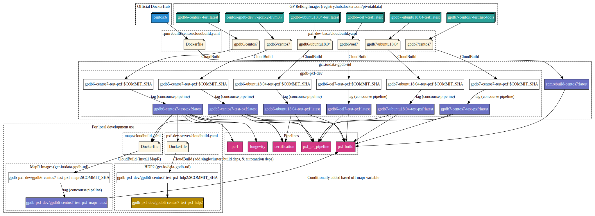

# Diagram of Container Image Building

This diagram details the docker images that are used and created by PXF pipelines and developers. It was generated using graphviz.

It can be recreated using the dot file by running `make` within this directory.
